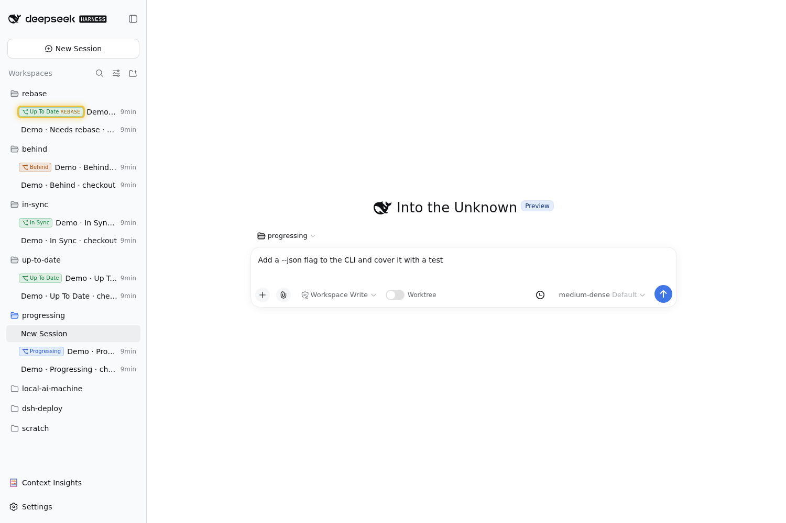
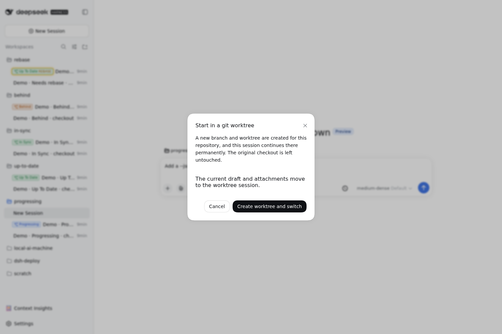
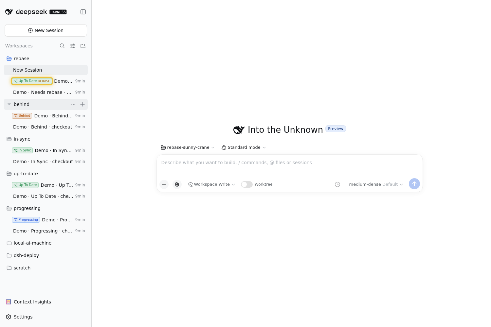
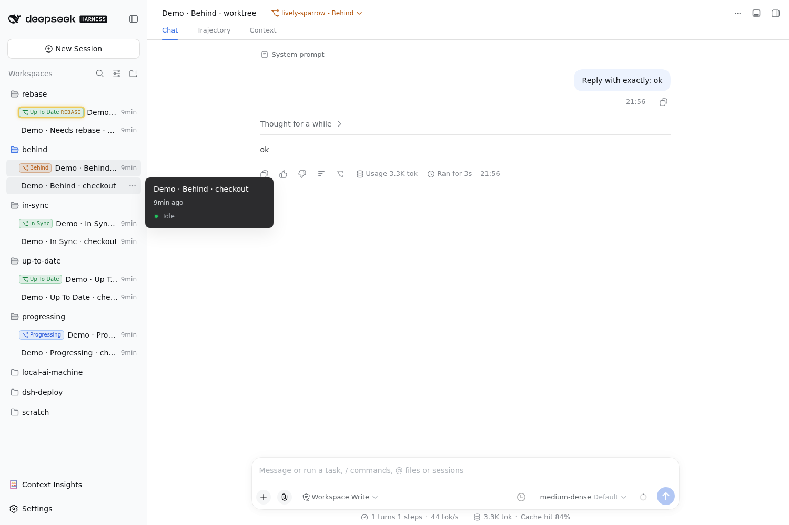
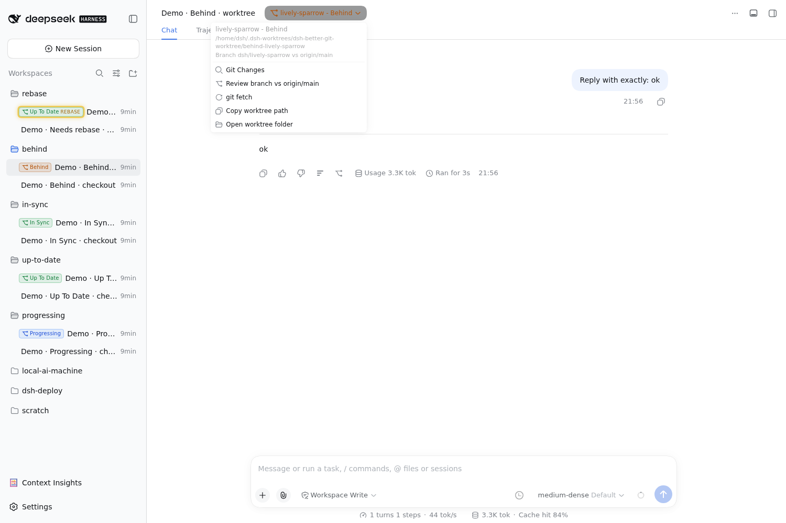
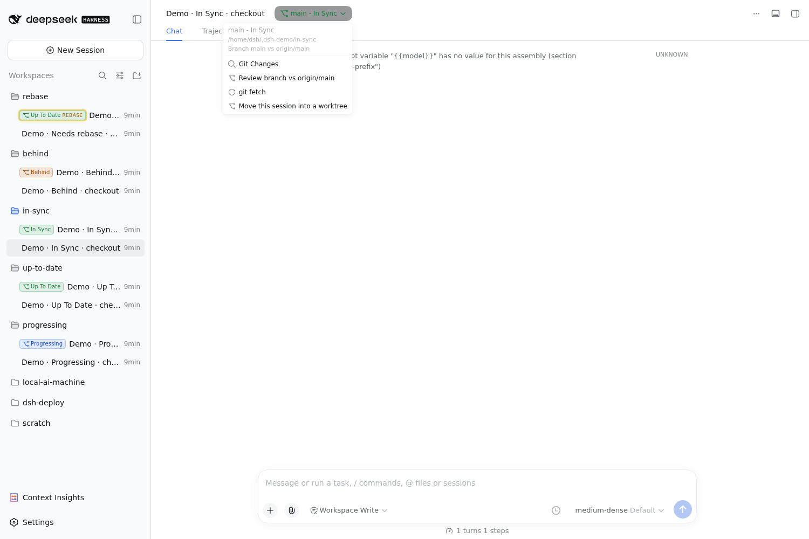
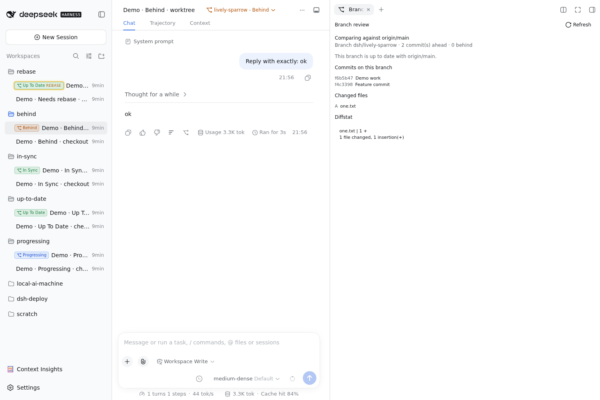
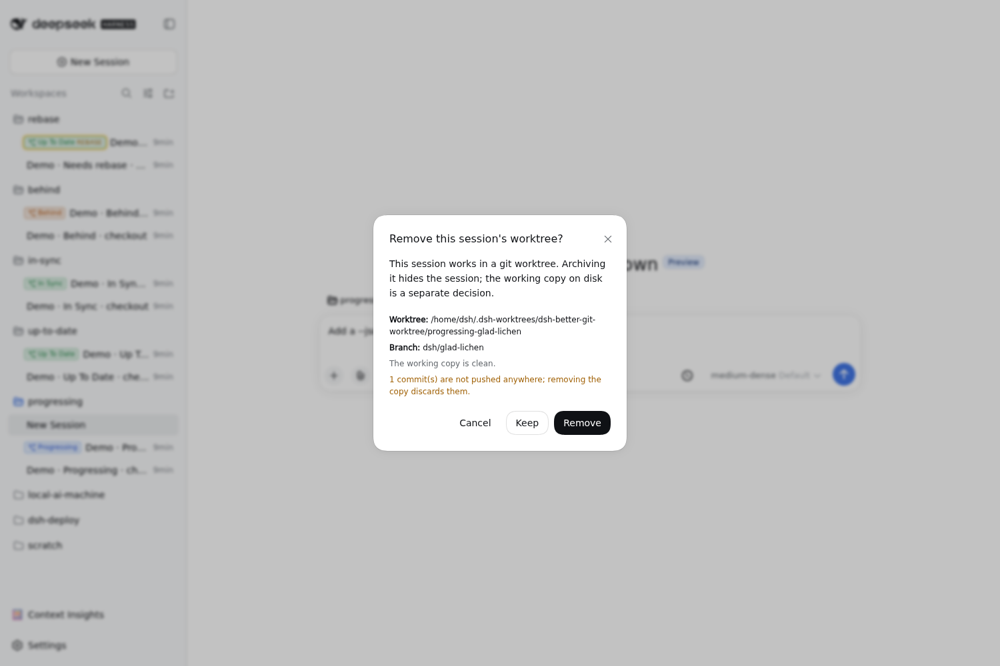

# dsh-better-git-worktree — usage guide

A session can work in its own **git worktree** for its whole life. This guide is
the operator's view: what each surface shows, what every action does, and what
the statuses mean. The design rationale (real linked worktrees, and the sandbox
escalation that implies) lives in the plugin `README.md`.

## Gallery

Every screenshot below is captured from a running harness, one per status, with
and without a managed worktree.

### New session in a worktree



*The new-session composer holding a draft message, with sidebar status badges
Progressing, Up To Date, In Sync, Behind, and a yellow REBASE tag on the
rebase-needing branch.*



*Confirmation dialog shown when the composer is switched into a new git
worktree.*

### The session list



*Composer in a worktree workspace (chips `rebase-sunny-crane` and
`Standard mode`) with each session group showing its status badge in the
sidebar.*



*Worktree session view with the amber `lively-sparrow - Behind` header pill and
a hover tooltip over a sidebar session row.*

### The header menu



*Header-pill dropdown for a worktree session: Git Changes, Review branch vs
origin/main, git fetch, Copy worktree path, Open worktree folder.*



*Header-pill dropdown for a main-checkout session: Git Changes, Review branch vs
origin/main, git fetch, Move this session into a worktree.*

### Reviewing and retiring



*Branch-review panel comparing the worktree branch with `origin/main`
(2 commits ahead, 0 behind) with commits, changed files, and diffstat.*



*Archive-worktree dialog with the worktree path, branch, and unpushed-commits
warning; actions are Cancel, Keep, and Remove.*

## The mental model

Every session has a **checkout**: the directory it works in. For most sessions
that is the workspace directory itself. For a *worktree session* it is a managed
working copy on its own branch.

```
workspace directory            managed working copy
/home/dsh/project      ──▶     ~/.dsh-worktrees/dsh-better-git-worktree/project-brave-otter
   (main checkout)                     branch: dsh/brave-otter
```

Everything this plugin shows — the header pill, the sidebar badge, the menu — is
about *that checkout*, and it works the same whether the session is in a managed
worktree or in the workspace directory itself. Only two things are
worktree-specific: the sidebar badge, and the actions that manage the working
copy (copy path / open folder / remove on archive).

## Surfaces

### 1. Composer switch (blank sessions only)

A **Worktree** toggle sits in the composer tool row of a brand-new session.

- Off → the session runs in the workspace directory.
- Click it → one confirmation dialog → **Create worktree and switch**.
- The branch and working copy are created immediately and the session continues
  there permanently. The toggle then reads ON and is disabled: it is a statement
  of fact, not an action.

There is no review or acceptance step later — that is the difference from
`dsh-git-worktree`.

### 2. Header pill and menu

The session header shows a pill:

```
brave-otter - Progressing        main - In Sync
```

`<name> - <status>`, coloured to match the sidebar badge:

| part | what it is |
| --- | --- |
| name | the working copy's pet name (`brave-otter`), or the branch name (`main`) when the session runs in the workspace directory |
| status | one of the statuses below |

Clicking it opens the actions:

| action | what it does |
| --- | --- |
| **Git Changes** | opens the `dsh-better-sidebar` *Changes* tab (its git lens) for this session: staged/unstaged files, per-file diffs, stage/commit |
| **Review branch vs `<ref>`** | opens this plugin's *Branch review* panel: commits and changed files against the default branch, with a **Refresh** button |
| **git fetch** | runs `git fetch` in this session's checkout. Available for every session, worktree or not |
| **Copy worktree path** | copies the managed working-copy path (worktree sessions only) |
| **Open worktree folder** | hands the working-copy folder to the desktop file manager (`xdg-open`/`gio`/`nautilus`/…, `open` on macOS, `explorer` on Windows). If the host has no opener installed the menu says so instead of pretending |
| **Move this session into a worktree** | creates a worktree for a session that does not have one, moves its uncommitted work in, and continues the conversation in a session rooted there (workspace sessions only) |

### 3. Sidebar badge (worktree sessions only)

Rows for worktree sessions carry a small badge with the status and a full
tooltip; hovering shows the same detail in the session hover card. Worktree
sessions are listed **inside the workspace they were branched from**, not as
their own top-level workspace.

## Statuses

| Badge | Colour | Meaning | What to do |
| --- | --- | --- | --- |
| **Progressing** | blue | work is not published yet: no upstream, or commits ahead of the upstream | keep working, then `git push -u origin <branch>` |
| **Behind** | amber | the upstream has commits this branch lacks and the branch has nothing of its own | `git pull --ff-only` |
| **Up To Date** | green | exactly in step with its upstream, and the branch is not `origin/<default>` | nothing — it is pushed |
| **In Sync** | green | in step with its upstream *and* identical to `origin/<default>` | nothing — fully integrated |
| **Missing** | grey | the recorded working-copy directory is gone | archive the session and remove the worktree, or recreate it |

A **yellow glow** is a separate overlay: the branch has its own commits *and*
`origin/<default>` has moved on, so it needs rebasing. It appears on top of any
status, and the tooltip spells out how many commits behind the default branch is.

The tooltip is always the complete answer — status, upstream, working-tree
counts, comparison with the default branch, and the last commit.

## Workflows

### Start a new task in a worktree

1. New session → pick the workspace.
2. Turn on **Worktree** → **Create worktree and switch**.
3. Work as usual. The session's checkout is the working copy; the main checkout
   is untouched.
4. When the work is ready, push the branch from inside the session
   (`git push -u origin <branch>`); the pill turns green.

### Move a session that already has work in progress

1. Open the session and use **Move this session into a worktree** in the header
   menu (or ask the agent to call the `worktree_convert` tool).
2. A branch and working copy are created; the session's uncommitted work is moved
   into it.
3. The conversation continues in a session rooted in the working copy.

The move uses `git stash` in the source checkout and replays the same change into
the working copy. The stash entry is deliberately kept as a backup and its ref is
reported in the tool result; if the replay fails, the stash is popped back.

### Review what an agent changed

- **Git Changes** — the file-level view (the sidebar's own git lens).
- **Review branch vs origin/main** — the branch-level view: commits, changed
  files, diffstat against the default branch. Hit **Refresh** after running
  **git fetch**.

### Retire a worktree session

Archiving a worktree session prompts first:

| button | what it does |
| --- | --- |
| **Cancel** | nothing happens |
| **Keep** | the session is archived; the working copy stays on disk |
| **Remove** | the working copy is deleted, the registry record is dropped, and the dead workspace registration is retired — nothing is left behind in the sidebar |

The dialog names the path and branch and warns about uncommitted paths and
unpushed commits, so **Remove** is never a surprise.

## Where things live

| what | where |
| --- | --- |
| working copies | `$DSH_HOME/worktrees/dsh-better-git-worktree/<project>-<pet>`, or `~/.dsh-worktrees/dsh-better-git-worktree/…` when `$DSH_HOME` is inside the repository being branched |
| session → worktree registry | `$DSH_HOME/plugins/dsh-better-git-worktree/worktrees.json` |

A working copy is a real linked worktree: its branch and objects live in the
source repository, so `git worktree list` there shows it, and the branch is
visible from the main checkout as soon as it is created.

Because a linked worktree's index and branch ref live in the source repository's
`.git`, a `git add` or `git commit` inside the worktree writes outside the
session's own checkout. Under the default `workspace-write` policy that is
exactly the case the sandbox asks you to approve — accept the escalation when you
want the agent to commit, or let it work without committing.

## Limits worth knowing

- **A running session cannot change its checkout.** `session.header.cwd` is
  immutable creation metadata, so "convert this session" creates a session in the
  worktree and continues the conversation there.
- **This harness build has no un-archive affordance.** Archiving is one-way from
  the UI; the plugin's own flows archive source sessions, so it keeps the sessions
  it owns visible rather than letting them disappear silently.
- **`Open worktree folder` needs a desktop opener.** On a host with no file
  manager launcher installed, use **Copy worktree path** instead — the menu
  reports the missing opener explicitly.
- **Statuses are read from local refs.** `git fetch` (in the menu, or the
  plugin's own throttled background fetch) is what makes "Behind"/"In Sync"
  reflect the real remote.
